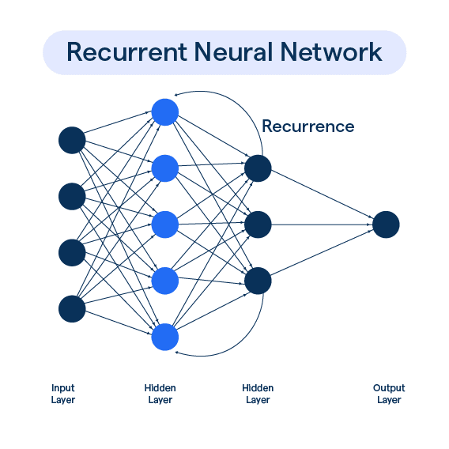
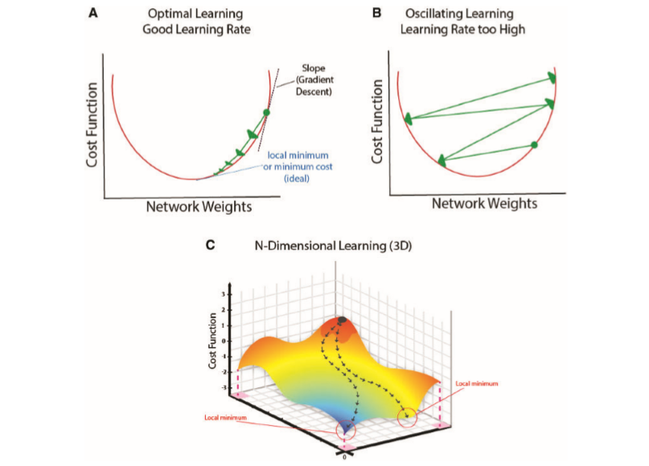

## Recurrent Neural Networks {#sec-RNNs}

> These notes are based on Josh Starmer's video 

In order to work with time series data to predict the following 
point, we need to use a model which account for a varying amount
of inputs. For example, in stock market price prediction, we want
to inputs with a varying amount of input values available for each.

Just like other neural network architectures, RNNs take an input and 
feed it through an activation. However, RNNs loop the input multiple times
through the activation in order to obtain an output. 

{fig-align="center"}

Alternatively, we can think of this process as unrolling the network
for sequential time series points. 

Suppose:

<!--NOTE: `\mskip{1em}` doesn't work with xelatex. you need to use `\mskip arg` instead-->

\begin{align*}
    & t_{1} \rightarrow ReLU(W_{11}t_{1} + b_{11}) = y_{1} \\
    & t_{2} \rightarrow ReLU(W_{12}t_{2} + b_{12} + y_{1}) = y_{2} \\
    & \mskip 10mu \vdots \\
    & W_{22}y_{2} + b_{2} = \text{ predicted value}
\end{align*}

Notice that the output for $t_{1}$ is essentially used as a bias for the 
second input. This process can be extended to an arbitrary number of sequence
numbers. **NOTE**: even though we unroll the network, the weights and 
biases are shared!! This means that we never increase the number of weights
and biases to train. 

### Reasons NOT to use RNNs {#sec-vanish-explode}

The more we unroll a network, the harder it becomes to train the network. 
This leads to the *vanishing and exploding gradient problem.*

{fig-align="center"}

For example, let's suppose some weight is given for $W_{1}$ (in all unrollings of the 
network) as $2$. Then, every time we run the input, we perform $2 \times y_{i-1}$ which
eventually gets us $2^{n} \times inputs$ which ends up almost always being a gigantic
number, especially for values of $n$ which any reasonable size, say $n > 50$ or so. 
This huge number makes it extremely difficult to take small steps towards the correct
parameter value. This means that instead of taking small steps, we will end up with 
extremely large jumps, meaning that we will bounce. However, if you use weight values
which are less than $1$, then you will obtain values which are extremely small, meaning
that the maximum number of training steps will be reached before finding the optimal 
values. 

LSTMs can be used to largely avoid this problem. See @sec-LSTMs