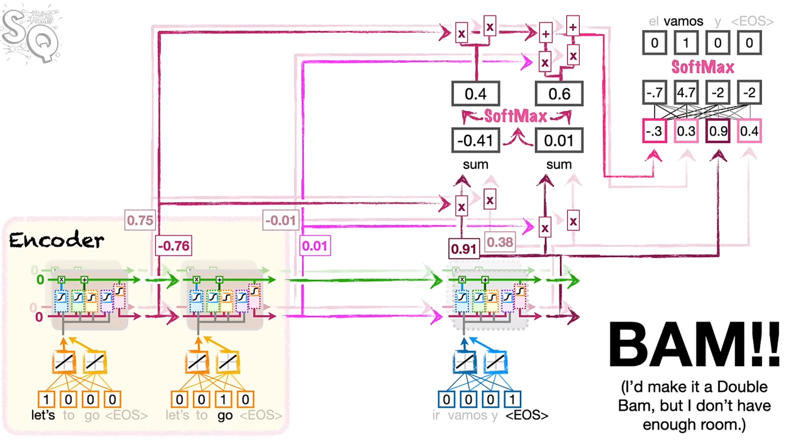

# Attention for Neural Networks

> These notes are based on Josh Starmer's video 
[Attention for Neural Networks, Clearly Explained!!!](https://www.youtube.com/watch?v=PSs6nxngL6k)

**Issues with the basic encoder-decoder architecture**

When we unroll the LSTMs in the encoder-decoder architecture, we end up compressing
the entire input sentence into a single context vector. This is ok for short 
phrases, but for bigger input vocabularies this might not work. For example, 
words which come earlier on may be forgotten. For example, this would be a
big issue if the first word at the beginning of "Don't eat the pizza while 
petting the cat".

**The Novelty of Attention**

Instead of having information forgotten by the LSTMs, new paths are created from 
older units (further towards the front) directly to the decoder so they can serve as inputs.
However, adding these extra paths is not a simple process. This style of model
is consistent for all encoder-decoder models with attention. 

*The Process of Attention*

{fig-align="center" width=80%}

+ attention determines how similar the outputs from the encoder LSTMs are at 
  each step. (a similarity score between LSTM outputs  and the firs tstep of the decoder)
+ There are many ways to determine the similarity of two word embeddings
  + cosine-similarity: $$\text{cosine similarity } = \frac{\sum_{i=1}^{n}A_{i}B_{i}}{\sqrt{\sum_{i=1}^{n}A_{i}^{2}}\sqrt{\sqrt{\sum_{i=1}^{n}B_{i}^{2}}}}$$
    + the numerator calculates the similarity between two sequences of numbers
    + the denominator scales the value to between $0$ and $1$. 
    + alternatively, the numerator can be used alone - the scaling may or may not be necessary in all cases. This numerator
    is simply referred to as the dot product. this metric is more common because it is  
+ If the score for one word is higher, we want that word to have more influence on the first word that
  comes out of the decoder. 
  + scores are run through the softmax function, and the output determines the percentage of the 
    decoding accounted for by each of the input words. This output is run through a fully connected layer
    and softmax is used to determine the resulting word. 

Just like with encoder-decoder networks, you keep using the next word, unrolling the network, 
if the predicted word is not `<EOS>`

However, now that attention has been added to the model, it actually turns out that the 
LSTM modules are not necessary. 