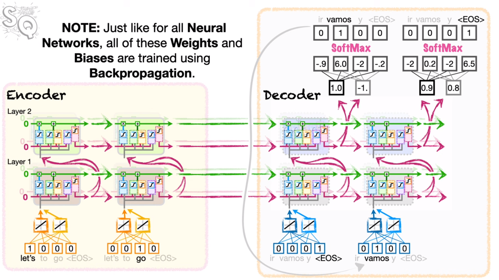

## Sequence-to-Sequence (seq2seq) Encoder-Decoder Neural Networks {#sec-seq2seq}

> These notes are based on Josh Starmer's video 
[Sequence-to-Sequence (seq2seq) Encoder-Decoder Neural Networks, Clearly Explained!!!](https://www.youtube.com/watch?v=L8HKweZIOmg)

**Sequence-to-sequence problems** - when you want to translate one sequence into 
a sequence of another kind, then you have a sequence-to-sequence problem. 
seq2seq models can be used to address these sorts of problems. 

To understand these models better, take the following example. Suppose you 
want to translate the sentence, "Let's go." into Spanish - "Vamos."

+ *challenge 1*: different sentences can be of different length, so the model needs to be
  capable of accepting inputs of multiple lengths. 
+ *challenge 2*: the output must be able to accomodate a varying length sentence.

*LSTMs* can be used to address this problem. Namely, you would need to plug "Let's" and 
then "go" into the LSTM sequentially. Also, since the vocabulary of words we 
train our model on incorporate a variety of words and symbols, we call these 
elements "tokens". Of course, words are used through vector embeddings of words
to avoid as much computational overhead as less efficient methods. 

{width=80% fig-align="center"}

Of course, additional LSTM cells can be added (horizontally) in order to increase the number 
of weights and biases. Additional layers (vertical) of LSTMs can also be added. 

+ layers - additional LSTM cells which are added on top of the previous layer. They 
  are connected sequentially, and take inputs from the short-term memory outputs
  of the LSTM cell which sits beneath them. This short-term memory output moves 
  forward to the next cell in the layer too. 

These units form the encoder portion of the "encoder-decoder" model. The last long-term memories from the 
last cells of all layers of the encoder portion form the context vector which initializes
the long and short-term memories of the decoder LSTMs. 

The decoder portion of the network is comprised of an idetical number of layers and cells
(it's not clear to me at this time whether this is a required behavior of seq2seq networks)
but has separate weights and biases from the encoder. The ultimate goal of 
the decoder is to decode the context vector from the encoder to the output sentence. 

Just as in the encoder, the input to the first activation of the LSTM cell is 
an embedding layer (create a vector embedding of the word). Once the LSTM is run, 
the output of the top cell of the final layer is run through a fully connected layer
to outputs. The FC layer as an input for each of the outputs in the LSTM (long and short-term
memory) and an output for each of the tokens in the Spanish vocabulary, and softmax classification
is used to determine what the output word is. This word is actually fed back to the 
next cell in the first layer of the decoder which embeds the output as an input to the subsequent
LSTM cells. The decoder will unroll the two LSTM cells (in the 
first and second layers of the decoder - reading inputs) until an <EOS> token has been output
by the decoder. Alternatively, the decoder will stop when the maximum output length is reached. 

### Unique features of Encoder-Decoder Training

During inference with encoder-decoders, the output of the LSTM cell in the top 
layer is used as input to the embedding layer for the next set of LSTM cells. 
However, during training, the actual next word embedding is used isntead, 
rather than the predicted word embedding. Additionally, each output 
phrase ends where the known phrase ends! This method is known as 
*Teacher forcing*
