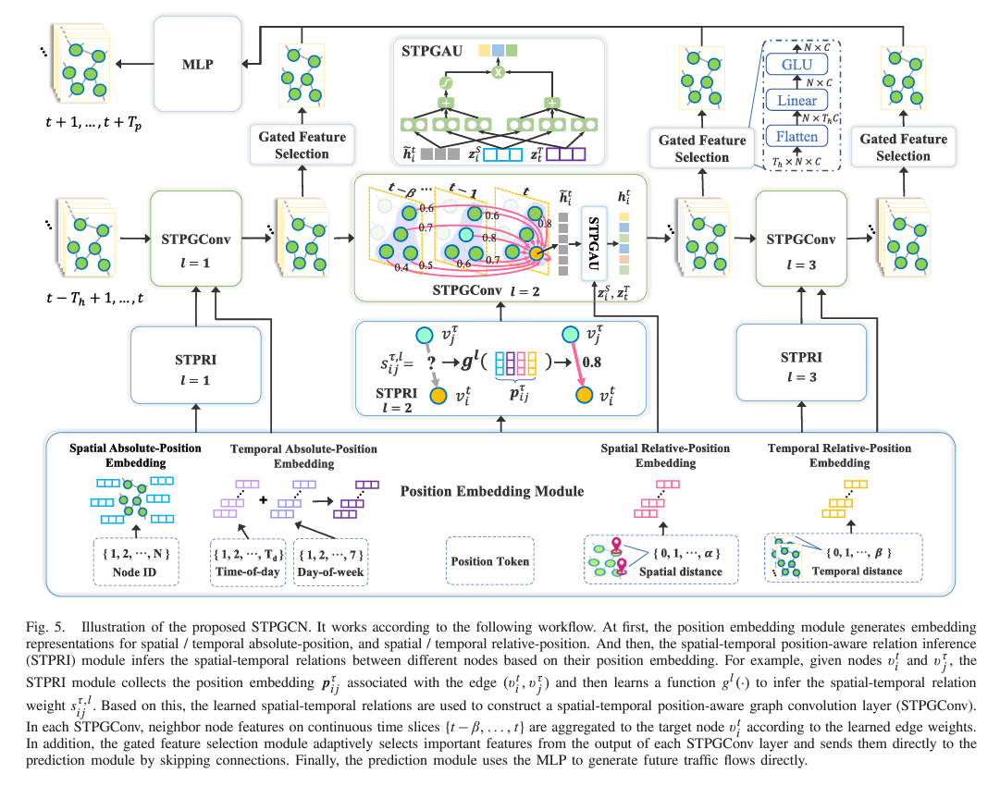
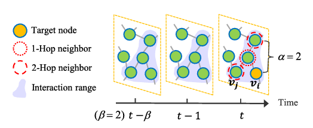

## STPGCN

> [PyTorch repository for this model](https://github.com/yijizhao/STPGCN/tree/main) The Notes 
from this section are based on the paper: "Spatial-Temporal Position-Aware Graph 
Convolution Networks for Traffic Flow Forecasting" @zhao2023etal

### Contributions 

+ introduce a spatial-temporal graph representation - models (1) spatial, (2) temporal,
  and (3) joint spatial-temporal correlations
+ develop a position embedding module - encodes spatial-temporal position factors and
  relation inference module - learn dynamic spatial temporal edge weights
+ the authors try to incorporate node-specific patterns and information (from historical data) 
  to improve prediction accuracy at each node. They propose a graph operator, `STPGConv`
  for this purpose, as it captures a wide range of spatial, temporal, 
  and joint spatial-temporal correlations
+ the network computes spatial-temporal relations in using a pure graph convolution approach. 
  no external temporal components are required, which improves overall efficiency (at least
  according to their experimental results) 
+ design an $L$-layer network based on the `STPGConv` operation
  + includes skip connections
  + gated selection modules 
  + these additions help to overcome problem of vanishing gradient and *feature over-smoothing*
+ concatenate features generated by multiple network layers to get an MLP predictor that directly
  predicts multi-step traffic flows
+ typical layer count is $L=3$. possesses fewer parameters, is computationally efficient

### Methods

Zhao et al. propose a novel model and graph convolution architecture for predicting
traffic flows based on spatio-temporal information:

{fig-align="center"}

**Step 1: formulate the graph**

+ the spatio-temporal graph is represented as a series of $\beta$ time steps 
  $t,t-1,\dots,t-\beta$ where each time step is represented by a graph 
  $\hat{A} \in \mathbb{R}^{N \times N}$. 
  + $\hat{A}$ is an $\alpha$-hop adjacency 
    matrix of the road network: a picture of these hops can be seen below: 

    {fig-align="center"}
  + each element of $\hat{A}$, the adjacency matrix, is given as follows:
    $$
    \hat{A}_{ij} = \begin{cases}
      1 & \text{if SDist}(v_{i}, v_{j}) \le \alpha, \\
      0 & \text{if the shortest path between } v_{i} \text{ and } v_{j} \gt \alpha
    \end{cases}
    $$
    in other words, if the shortest path between any two nodes in the spatial direction
    is of a distance less than $\alpha$, then there is an $\alpha$-hop edge which 
    connects the two nodes - hence a $1$ fills that connection label in the matrix $\hat{AGraph Edge Weights**

**Step 2: Set edge weights for the unweighted graph**

+ *spatial and temporal absolute-position embeddings*
  + spatial embeddings are defined - represent the absolute position of a given vector
    $$Z^{S} = [z_{1}^{S}, Z_{2}^{S}, \dots, Z_{N}^{S}] \in \mathbb{R}^{N \times d}$$
  + temporal embeddings are defined similarly
    $$Z^{S} = [z_{1}^{T}, Z_{2}^{T}, \dots, Z_{N}^{T}] \in \mathbb{R}^{T_{d} \times d}$$
    where $Z_{t}^{T} = z_{m}^{D} + z_{n}^{W}$. 
    + $z_{m}^{D}$ - the temporal position embedding for the day - $\{1,2,\dots,T_{d}\}$
    + $z_{n}^{W}$ - the temporal position embedding for the - $\{1,2,\dots,7\}$
+ *spatial and temporal relative-position embeddings*
+ *spatial-temporal position-aware relation inference*

**Step 3: Perform Spatial-Temporal Position-Aware Graph Convolution**
  

**Spatial-Temporal Graph Construction**

+ Mathematical formulation: 
  \begin{align*} A_{STP} = \begin{array}{ccccccc} & & t & t-1 & \dots & t - \beta & \\
    t & [ & \hat{A} & \hat{A} & \dots & \hat{A} & ] \end{array} \\
    A_{ij} = \begin{cases} 1 & \text{if SDist}(v_{i}, v_{j}) \le \alpha \\ 
                           0 & \text{otherwise} \end{cases} \end{align*}
  + $\hat{A}_{ij}$ represents an $\alpha$-hop adjacency matrix of the traffic road network
    + this means that connections over $\alpha$ edges between nodes are represented in 
      the graph structure. 

**Spatial and Temporal Relative-Position Embedding**

+ describes the spatial-temporal proximity between different nodes
+ helps identify the relative positions between separate nodes
+ relative position embeddings are trained to *encode distances*
+ $a = SDist()$ and $b = TDist()$, where $a=0$ means two nodes have the same 
  spatial position, and $b=0$ means two nodes have the same temporal position 
  (are taken from the same time slice)
  + values $a$ and $b$ are label tokens which have trainable embedding vectors
    $z_{a}^{SD}$ and $z_{b}^{TD}$ for each token

**Spatial-Temporal Position-Aware Relation Inference**

### Evaluation

### Questions

+ I still don't know what "Gated Activation Units" are